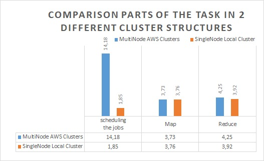

# hadoop-map-reduce
This repo is a part of Big Data Processing and Analysis course project that consist statistical operations on the application using Hadoop MapReduce framework.

## Motivation
In e-commerce sites, hundreds of transactions are carried out per minute. This transaction history
data may contain valuable information for stores. However simple mathematical methods may be
insufficient to analyze the data in cases where data flow is fast and it challenging to store it on a
physical devices.

## Goal
Designing and implementing an application to process big data containing the e-commerce behavior
dataset.

## Environments
- Four AWS EC2 instances with Ubuntu 16.04
- Multimode hadoop cluster 2.7.1 installed on instances
- Java classes with Hadoop Map Reduce API
- Python and Flask Web Framework for GUI
- Bourne shell scripts to start jobs (server connection, transferring data etc.)

## Map Reduce Implementation
**Count**: finding the number of views of a particular brand's products or all products in the store.

- Filtering is done according to the event type = views in map function
- After mapping for each views the key value pair: <productid , 1>
- Values are combined: <productid , [1,1,1,1…1] >
- Values are added in reduce function.
- After the reduce function, key value pair <productid, # totalView>

**Average:** Calculating the average earnings per unit of product for a particular brand or for all brands
in the store

- Filtering is done according to the event type = purchase in map function
- After Mapping the key value pair:<brandName, price>
- Values are combined: <brandName, price[ ]>
- Prices are added and divided to number of the value size in the reduce function.
- After the reduce function, key value pair: <brandName, avgPrice>

**MinMax:** Finding the cheapest and most expensive products for each brand in the store

- The CoupleWritable(double, int) class is used to write 2 variables to a value.
- After Mapping the key value pair: <brandName, (price,productId)>
- After combining the key value pair: <brandName, (price,productId)[ ] >
- In reduce function, min and max values are searched.
- After reducing the key value pair: <brandName, (minPrice,productId)> 

**StdDeviation:** Finding the standard deviation in the prices of products for each brand in the store

- After Mapping the key value pair: <brandName, price>
- After combining  the key value pair: <brandName, price[]>
- Std dev are calculated in reduce function.
- After reducing the key value pair: <brandName, stdDevOfPrices>

**Median:** Finding the median value in the prices of products for each brand in the store

- After Mapping <brandName, price>
- After combining the key value pair: <brandName, price[ ]>
- Finding median value in reduce function.
- After reducing the key value pair: <brandName, medianOfPrices>

## Performance Evaluation

Application are performed in local computer with single node hadoop cluster and Amazon EC2 server with 4 node hadoop cluster. 

Functions were run 10 times in each configuration and the following results were obtained by averaging the elapsed time.

|                     | Dataset Size | Avg funct Time (sec) | Count funct. Time | MinMax Funct Time | Stdev Funct. Time | Median Funct. Time |
|---------------------|--------------|----------------------|-------------------|-------------------|-------------------|--------------------|
| Single Node (Local) | 100 MB       | 8.22                 | 9.10              | 7.73              | 9.09              | 9.79               |
| Single Node (Local) | 500 MB       | 16.45                | 18.16             | 13.75             | 16.97             | 17.70              |
| 4 node AWS          | 100 MB       | 21.36                | 24.77             | 20.12             | 24.53             | 25.02              |
| 4 node AWS          | 500 MB       | 25.49                | 29.84             | 22.16             | 26.91             | 30.18              |

As we can see from the table, although running an extra cluster is more costly than running a single node, as the data size increases, the processing performance of the multi node becomes more evident. It is obvious that it will be more advantageous to use multiple nodes when working with sufficiently large data.

The following graph shows that scheduling task is a time consuming operation for multi node cluster. The map and reduce algorithms that work in multiple clusters are pretty good as in a single cluster.

